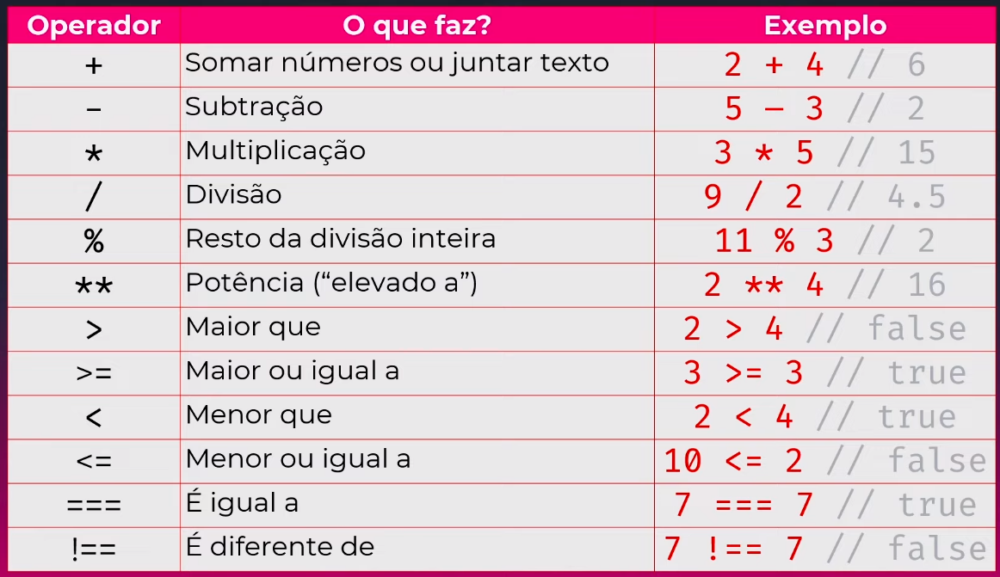

# Estudo de JavaScript

Este repositório contém meus exercícios e projetos relacionados ao estudo de JavaScript. Aqui, estou aprendendo os conceitos básicos e explorando diferentes aspectos da linguagem.

## Comandos Básicos

### Variáveis: Aprender sobre a declaração de variáveis e seu uso.
```javascript
let nome = "Maria";
let idade = 30;
let altura = 1.65; 


const PI = 3.14159;
const URL = "https://www.example.com";
```


### Tipos de Dados: Explorar os diferentes tipos de dados em JavaScript.
**String**: Uma sequência de caracteres. Exemplo:
```javascript
let nome = "João";
let mensagem = "Olá, mundo!";
```


**Number**: Um valor numérico:
```javascript
let idade = 25;
let altura = 1.75;
```


**Boolean**: Um valor que representa verdadeiro (true) ou falso (false). Exemplo:
```javascript
let temPermissao = true;
let estaAtivo = false;
```


**Array**: Uma estrutura que armazena vários valores em uma única variável, acessíveis por meio de índices. Exemplo:
```javascript
let numeros = [1, 2, 3, 4, 5];
let nomes = ["Maria", "João", "Ana"];
```


**Operadores**



**Object**: Uma coleção de propriedades que descrevem um objeto. Cada propriedade consiste em um nome e um valor. Exemplo:
```javascript
let pessoa = {
  nome: "João",
  idade: 30,
  altura: 1.8,
};
```


**Null**: Um valor especial que indica a ausência de valor. Exemplo:

```let valorNulo = null; ```


**Undefined**: Um valor que é atribuído automaticamente a variáveis que foram declaradas, mas ainda não têm valor atribuído. Exemplo:

``` let valorIndefinido; ```


___


### Estruturas de Controle: 
**IF-ELSE**: Permite executar um bloco de código se uma condição for verdadeira e outro bloco de código se a condição for falsa. É útil quando você precisa tomar decisões com base em uma condição.
Exemplo:
```javascript
if (idade >= 18) {
  console.log("Você é maior de idade.");
} else {
  console.log("Você é menor de idade.");
}
```


Loop **FOR**: Executa um bloco de código repetidamente por um número específico de vezes. É adequado quando você sabe exatamente quantas vezes deseja repetir uma determinada ação.
Exemplo:
```javascript
for (let i = 0; i < 5; i++) {
  console.log("Contagem: " + i);
}
```


Loop **WHILE**: Executa um bloco de código repetidamente enquanto uma condição específica for verdadeira. É útil quando você não sabe o número exato de iterações necessárias e precisa repetir uma ação até que uma condição seja atendida.
Exemplo:
```javascript
let contador = 0;
while (contador < 5) {
  console.log("Contagem: " + contador);
  contador++;
}
```


**Switch**: Permite executar diferentes blocos de código com base em diferentes casos. É uma alternativa ao uso de múltiplas declarações if-else aninhadas quando você precisa tomar decisões com base em múltiplas opções.
Exemplo:
```javascript
let diaSemana = "segunda";
switch (diaSemana) {
  case "segunda":
    console.log("Hoje é segunda-feira.");
    break;
  case "terça":
    console.log("Hoje é terça-feira.");
    break;
  // outros casos...
  default:
    console.log("Dia não reconhecido.");
    break;
}
```

___


### Funções:  em JavaScript.
```javascript
// Função que recebe um parâmetro e retorna o quadrado do valor
function quadrado(numero) {
  return numero * numero;
}

// Chamada da função e armazenamento do resultado em uma variável
let resultado = quadrado(5);
console.log(resultado); // Saída: 25

```


### Objetos: Entender o conceito de objetos e como usá-los em JavaScript.
```javascript
// Declaração de um objeto representando uma pessoa
let pessoa = {
  nome: "João",
  idade: 25,
  profissao: "Engenheiro",
  casado: false,
  hobbies: ["leitura", "esportes", "cozinhar"],
  saudacao: function() {
    console.log("Olá, meu nome é " + this.nome + "!");
  }
};

// Acesso às propriedades do objeto
console.log(pessoa.nome); // Saída: "João"
console.log(pessoa.idade); // Saída: 25
console.log(pessoa.profissao); // Saída: "Engenheiro"
console.log(pessoa.casado); // Saída: false

// Chamada de um método do objeto
pessoa.saudacao(); // Saída: "Olá, meu nome é João!"
```


## Recursos Adicionais

Aqui estão alguns recursos úteis para aprofundar o estudo de JavaScript:

- Livro: "Eloquent JavaScript" por Marijn Haverbeke.


***Sinta-se à vontade para explorar este repositório e compartilhar suas sugestões e feedbacks.***
